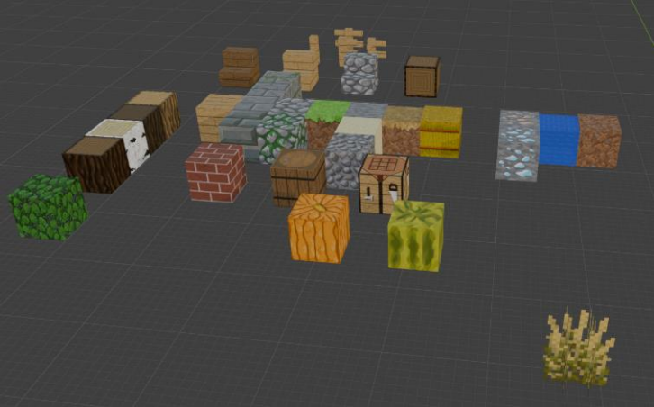
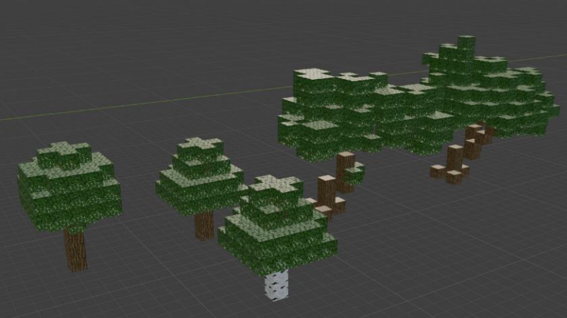
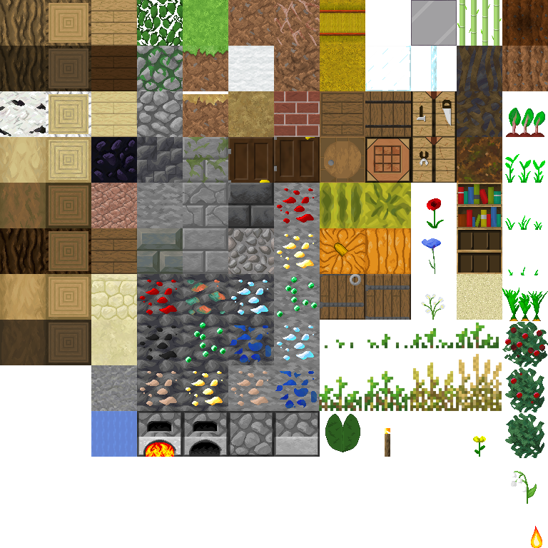
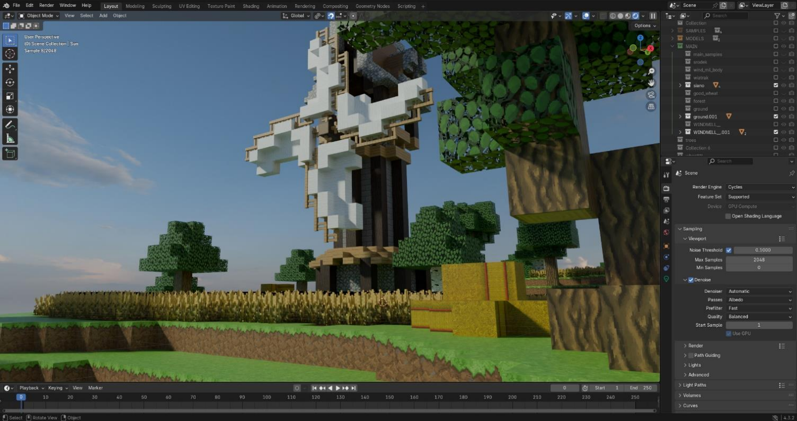
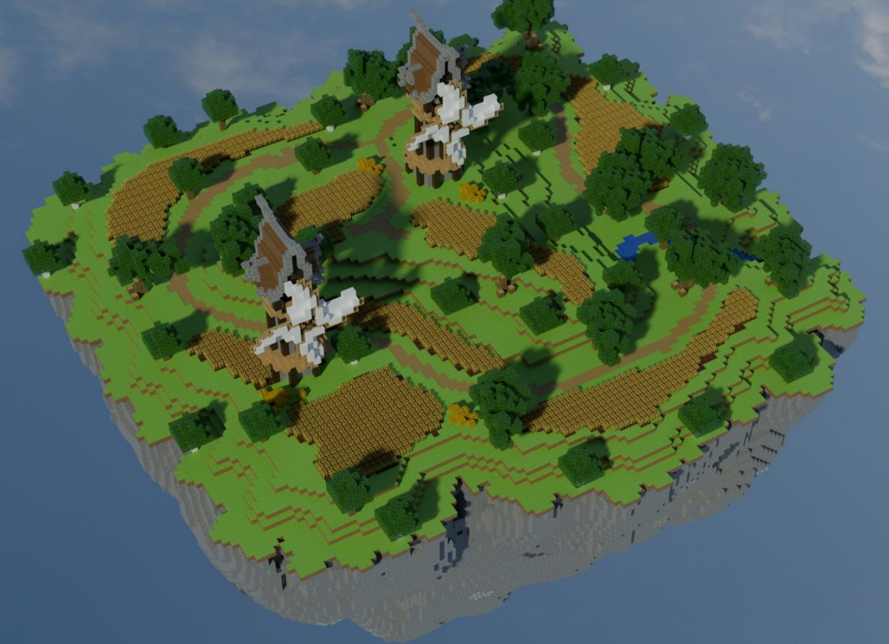
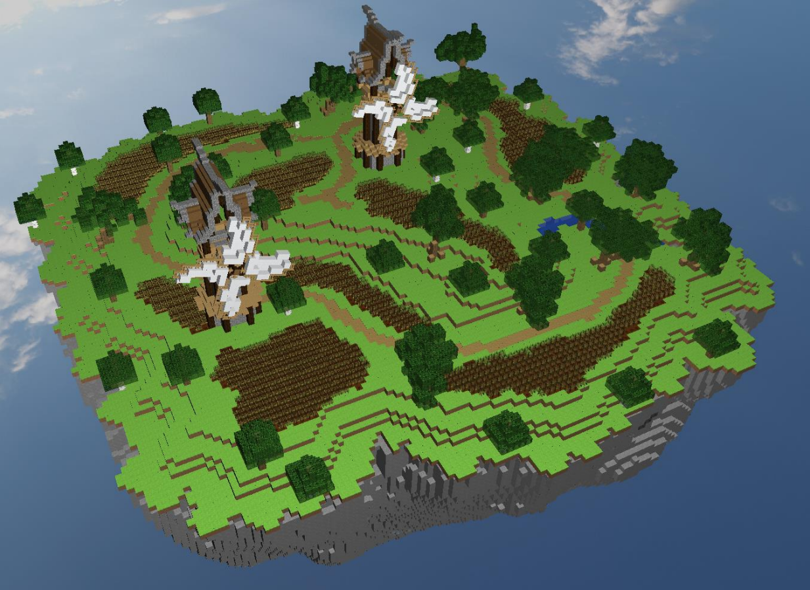
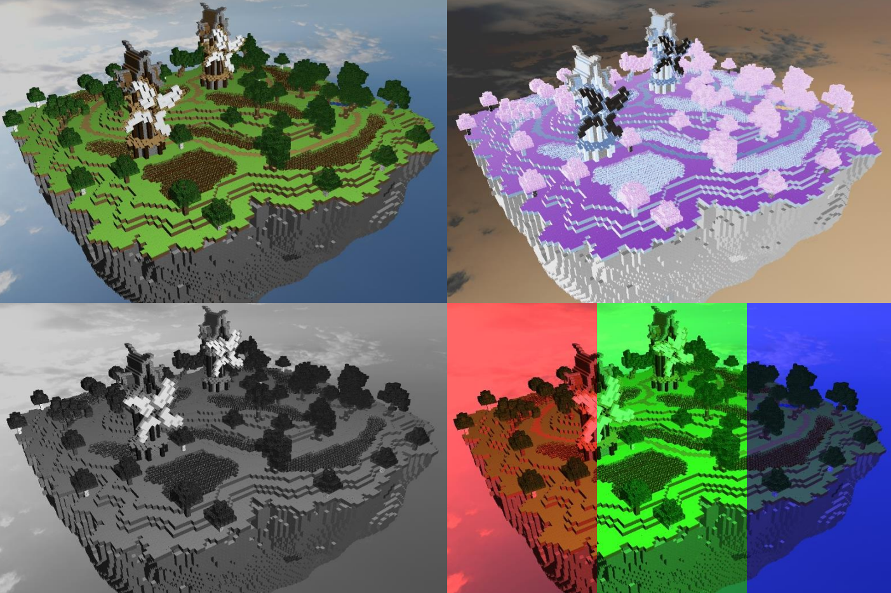
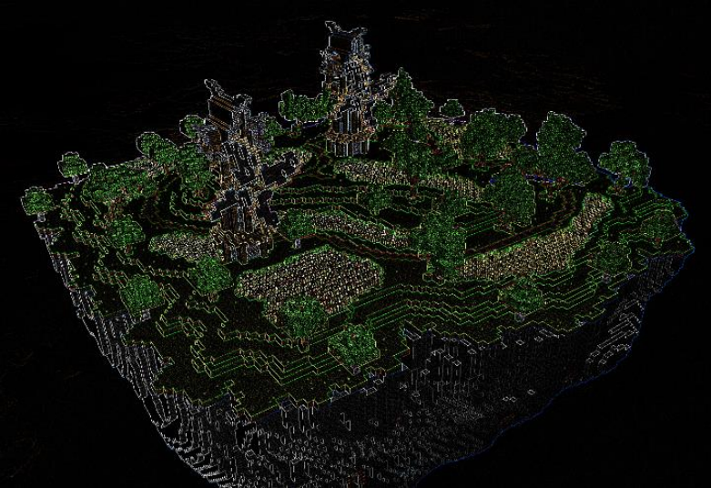

# opengl-voxel-scene
opengl-voxel-scene is a final project for the Computer Graphics course.

The project presents a model of an island (farm) based on the Skyblock concept from Minecraft. The scene consists of the following models: the island with windmills, the underside of the island, and two windmill propeller models. The user can move around the scene using the WASD keys and rotate the camera with the mouse.

## Models used in the project (created in Blender)

### A single texture was used for texturing.

Textures from the [Faithful Texture Pack](https://faithfulpack.net) \
accessed: 16.03.2026

## Scene visualization in Blender

## Expectations (Blender scene) vs Reality (OpenGL scene)

<table width="100%">
  <tr>
    <td width="50%">
      
    </td>
    <td width="50%">
      
    </td>
  </tr>
</table>

## Applied activatable post-processing filters

a) no filter  
b) negative  
c) grayscale  
d) red, green, blue filters  
e) edge filter

## Demo video

See demo video `./project-showcase.mkv`